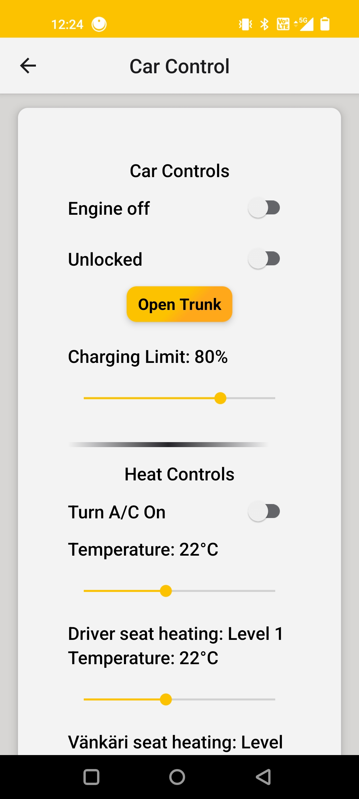
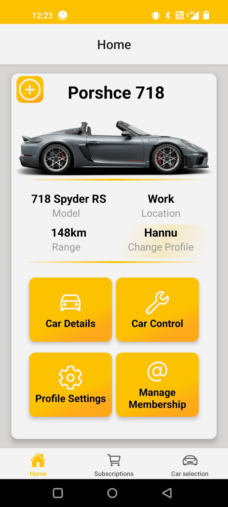
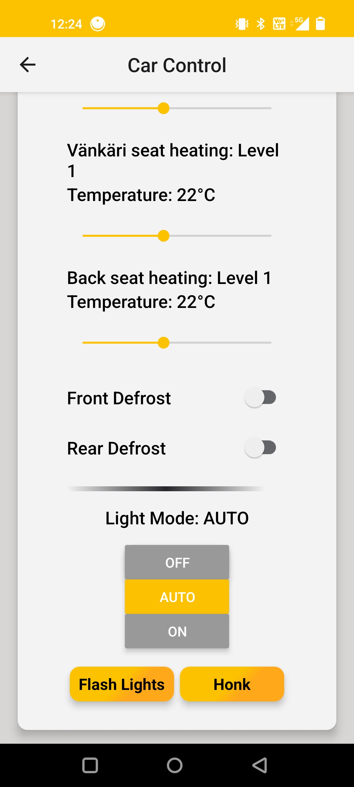
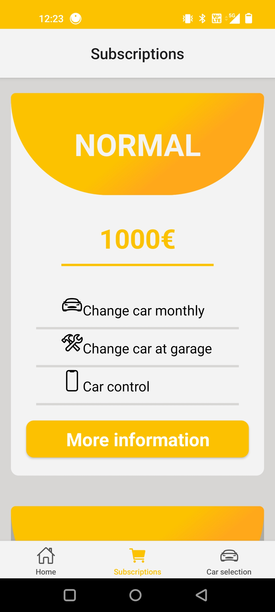
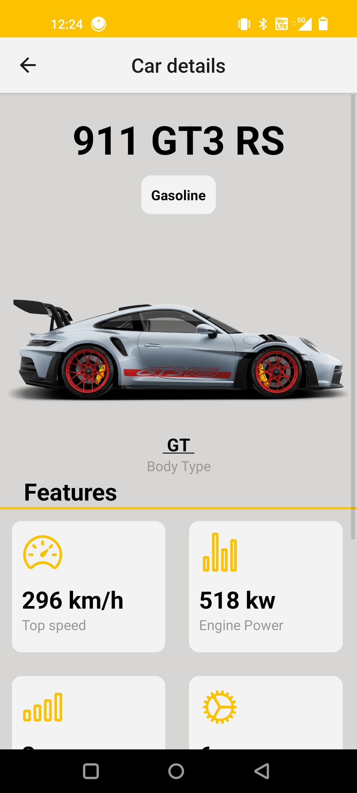

# DoorstepCarDelivery Changy

## Project overview
DoorstepCarDelivery is a mobile-first prototype that enables high end customers to lease cars, but with an easy subscription model. Schedule doorstep deliveries everywhere in the world, track delivery status, import personilized settings to the new car and get it all done fast. It focuses on a simple, imagery-driven UX to showcase vehicles and make scheduling effortless.

## Technologies
- React / React Native
- JavaScript / TypeScript
- Node.js 
- Metro / Webpack 
- Expo (cross-platform mobile development)

## Pictures
App home/ navigation

Car control  
  

Subscription

Car details

